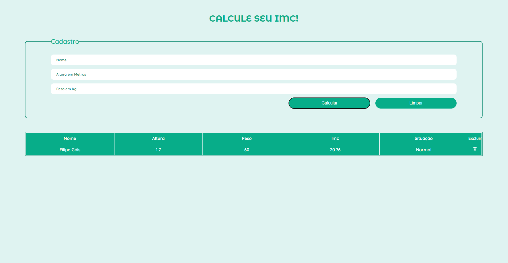

<!DOCTYPE html>
<html lang="pt-BR">
<head>
    <meta charset="UTF-8">
    <meta name="viewport" content="width=device-width, initial-scale=1.0">
</head>
<body>
<h1>Calculadora de IMC</h1>

Projeto pessoal desenvolvido para aprimorar meus conhecimentos em JavaScript puro e SASS, além de simular uma API utilizando JSON Server.

<h2>Problemática</h2>

Muitas pessoas têm dificuldade em acompanhar seus índices de massa corporal (IMC) devido à falta de ferramentas acessíveis e intuitivas. As calculadoras de IMC disponíveis muitas vezes carecem de funcionalidades básicas, como armazenamento de dados e análise de resultados ao longo do tempo.

<h2>Solução: Calculadora de IMC</h2>

A Calculadora de IMC foi desenvolvida para fornecer uma ferramenta simples e eficaz para calcular e acompanhar o IMC dos usuários. O projeto inclui funcionalidades básicas de CRUD para gerenciar registros de IMC, utilizando JSON Server para simular uma API.

<h3>✨ Diferencial do Projeto</h3>

O grande diferencial deste projeto é a utilização de JavaScript puro para a implementação de todas as funcionalidades, juntamente com SASS para o estilização, que é uma nova tecnologia para mim. Este projeto também inclui um CRUD para simulação de uma API, o que permite um gerenciamento eficiente dos dados dos usuários.

<h2>📋 Funcionalidades do Aplicativo</h2>
<ol>
    <li><strong>Cálculo de IMC:</strong>
        <ul>
            <li>Permite calcular o IMC com base no peso e altura informados.</li>
            <li>Exibe a situação do usuário com base no IMC calculado.</li>
        </ul>
    </li>
     
    <li><strong>Registro de Usuários:</strong>
        <ul>
            <li>Permite adicionar, editar e excluir registros de IMC dos usuários.</li>
        </ul>
    </li>
     
    <li><strong>Simulação de API com JSON Server:</strong>
        <ul>
            <li>Utiliza JSON Server para simular uma API RESTful.</li>
        </ul>
    </li>
</ol>
 

A Calculadora de IMC é projetada para ser uma ferramenta completa e acessível, ajudando os usuários a acompanhar seu IMC de forma eficiente e prática.

<h2>🔧 Ferramentas Utilizadas</h2>
<h3>Back-end:</h3>
<ul>
    <li><strong>Simulação de API:</strong> JSON Server</li>
</ul>
<h3>Front-end:</h3>
<ul>
    <li><strong>Linguagem:</strong> JavaScript Puro</li>
    <li><strong>Estilização:</strong> SASS</li>
</ul>
<h2>👥 Desenvolvedor</h2>
<ul>
    <li><a href="https://www.linkedin.com/in/filipe-góis-841b58206/" target="_blank"><strong>Filipe Góis</strong></a> - Desenvolvedor Full Stack</li>
</ul>
    <h2>📸 Exemplos Visuais do Aplicativo</h2>

    <figure style="display: flex; flex-direction: column; align-items: center;">
        <!-- <figcaption style="font-size: 30px;">Tela de Cálculo de IMC</figcaption> -->
        
    </figure>
    <figure style="display: flex; flex-direction: column; align-items: center;">
        <!-- <figcaption style="font-size: 30px;">Tela de Registros de Usuários</figcaption> -->
        
    </figure>

</body>
</html>
